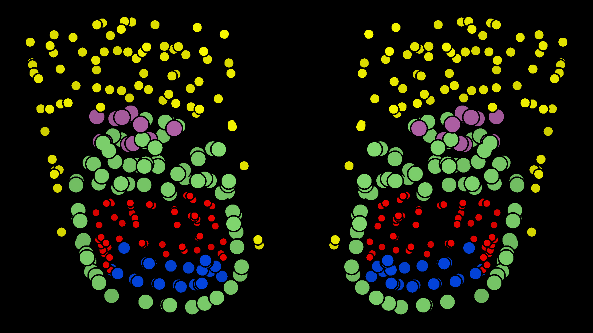

# Crystal Interface Generative Adversarial Network (CryinGAN)

CryinGAN is a generative adversarial network for generating periodic crystal structures, that was developed using disordered interface structures.

Despite its name, CryinGAN can accept any dataset of periodic structures as long as they have fixed lattice, composition, and number of atoms. 

<p align="center">
   
</p>

## Citation
```
@article{yong2024dismaibench,
         author = {Yong, Adrian Xiao Bin and Su, Tianyu and Ertekin, Elif},
         title = {Dismai-Bench: benchmarking and designing generative models using disordered materials and interfaces},
         journal = {Digital Discovery},
         year = {2024},
         volume = {3},
         issue = {9},
         pages = {1889-1909},
         publisher = {RSC},
         doi = {10.1039/D4DD00100A},
         url = {http://dx.doi.org/10.1039/D4DD00100A}
}
```

## Table of Contents
- [Crystal Interface Generative Adversarial Network (CryinGAN)](#crystal-interface-generative-adversarial-network-cryingan)
  - [Citation](#citation)
  - [Table of Contents](#table-of-contents)
  - [Prerequisites](#prerequisites)
  - [Datasets](#datasets)
  - [Usage](#usage)
    - [Input data](#input-data)
    - [Training CryinGAN](#training-cryingan)
    - [Output files of training](#output-files-of-training)
    - [Restarting training](#restarting-training)
    - [Command-line arguments for training scripts](#command-line-arguments-for-training-scripts)
    - [Generating structures from a saved model](#generating-structures-from-a-saved-model)
    - [Some (possibly) helpful tips](#some-possibly-helpful-tips)
  - [If you've made it this far](#if-youve-made-it-this-far)

## Prerequisites
CryinGAN requires the following packages:
- [PyTorch](http://pytorch.org) = 1.13.0
- [PyTorch3D](https://github.com/facebookresearch/pytorch3d/tree/main) = 0.7.4
- [ASE](https://wiki.fysik.dtu.dk/ase/) = 3.22.1

Note that these are only suggested package versions; other versions may also be compatible.

To run CryinGAN using GPU, please make sure that PyTorch3D is installed with CUDA support, otherwise you'll get an error.

## Datasets
Datasets are available [here](https://doi.org/10.5281/zenodo.12710372).

## Usage
### Input data
CryinGAN will accept a dataset of structures (fixed lattice, composition, and number of atoms) in an extxyz file. This can be prepared using the [ASE package](https://wiki.fysik.dtu.dk/ase/ase/io/io.html). 

### Training CryinGAN
CryinGAN can be trained with or without the bond distance discriminator. Using the bond distance discriminator should give better results, but an appropriate weight for the bond distance discriminator loss (`weight_dist`) needs to be chosen. A good way to start is to train without the bond distance discriminator first and find good hyperparameters for your dataset, then train with the bond distance discriminator.

To train a CryinGAN model without the bond distance discriminator, use the `train_no_dist.py` script:
```
python train_no_dist.py --training_data my_dataset.extxyz
```

To train a CryinGAN model with the bond distance discriminator, use the `train.py` script:
```
python train.py --training_data my_dataset.extxyz --weight_dist 0.05
```
Although you can set `weight_dist` to 0 to train "without the bond distance discriminator", it will be slower because the bond distances are still being calculated. 

Some other arguments worth setting are `print_freq`, `msave_freq`, and `gsave_freq`. See [below](#command-line-arguments-for-training-scripts) for more details.

### Output files of training
CryinGAN saves the losses to `losses.csv`. The columns of the file are:
| Column name  | Description                                                        |
| ------------ | ------------------------------------------------------------------ |
| epoch        | epoch number                                                       |
| distance_dis | Wasserstein distance                                               |
| cost_dis     | discriminator(s) cost                                              |
| cost_gen     | generator cost                                                     |
| D_real       | averaged output of coordinate discriminator for real structures    |
| D_fake       | averaged output of coordinate discriminator for fake structures    |
| D_dist_real  | averaged output of bond distance discriminator for real structures |
| D_dist_fake  | averaged output of bond distance discriminator for fake structures |

The learning rate of each epoch is also saved to `learning_rate.csv`.

CryinGAN also saves `losses_cp.csv` and `learning_rate_cp.csv`, which are only saved up to the epoch of the last checkpoint. These will be useful for restarting training.

Models are saved periodically to the `model_saves` directory (default directory name). The frequency of saving models can be set using the `msave_freq` argument. "Best" models are saved corresponding to the smallest Wasserstein distance, but do not necessariy correspond to the best models, because the models can continue to improve even after the Wasserstein distance has plateaud.

Generated coordinates are saved periodically to the `gen_data` directory (default directory name). They are .npy files storing the coordinates of a number of structures (up to 100 by default). The frequency of saving can be set using the `gsave_freq` argument.

The two latest checkpoints files are saved in the directory where the training script is runned. 

### Restarting training
Training can be restarted by providing the paths to the models and the checkpoint. The `losses.csv` and `learning_rate.csv` should be replaced with those saved at the last checkpoint. 

For an example restarting training with the bond distance discriminator:
```
mv losses_cp.csv losses.csv
mv learning_rate_cp.csv learning_rate.csv
python train.py --training_data my_dataset.extxyz --weight_dist 0.05 --load_generator model_saves/generator_100 --load_coord_disc model_saves/coord_disc_100 --load_dist_disc model_saves/dist_disc_100 --load_checkpoint checkpoint.pth.tar
```

### Command-line arguments for training scripts
The following command-line arguments can be passed:
| Argument        | Description                                                                                 |
| --------------- | ------------------------------------------------------------------------------------------- |
| training_data   | path to training data (.extxyz file)                                                        |
| n_epochs        | number of epochs                                                                            |
| batch_size      | batch size                                                                                  |
| g_lr            | Adam: generator learning rate                                                               |
| coord_lr        | Adam: coordinate discriminator learning rate                                                |
| dist_lr         | Adam: bond distance discriminator learning rate                                             |
| b1              | Adam: $\beta_1$                                                                             |
| b2              | Adam: $\beta_2$                                                                             |
| step_size       | step size of learning rate decay                                                            |
| gamma           | multiplicative factor of learning rate decay                                                |
| weight_dist     | weight of bond distance discriminator loss                                                  |
| latent_dim      | number of random numbers used for generator input                                           |
| gen_channels_1  | number of channels after the first layer of the generator                                   |
| n_neighbors     | number of nearest neighbors when calculating bond distances                                 |
| gen_int         | interval between generator trainings, the generator is trained once every "gen_int" batches |
| load_generator  | path to generator model to be loaded                                                        |
| load_coord_disc | path to coordinate discriminator model to be loaded                                         |
| load_dist_disc  | path to bond distance discriminator model to be loaded                                      |
| load_checkpoint | path to checkpoint to be loaded                                                             |
| msave_dir       | directory to save model files                                                               |
| msave_freq      | frequency of saving models, saved every "msave_freq" epochs                                 |
| gsave_dir       | directory to save generated data                                                            |
| gsave_freq      | frequency of saving generated data, saved every "gsave_freq" epochs                         |
| n_save          | maximum number of structures to save in each saved file                                     |
| print_freq      | print frequency of output, printed every "print_freq" batches                               |
| disable_cuda    | disables CUDA when called                                                                   |

### Generating structures from a saved model
To generate structures from a saved generator model, use the `generate_structures.py` script:
```
python generate_structures.py --load_generator model_saves/generator_100 --n_struc 1000 --ref_struc my_dataset.extxyz
```
The number of structures to be generated is set using `n_struc`, and the structures are saved as a single extxyz file.

The generator only generates coordinates so the remaining structural information is obtained from a reference structure. The training dataset or a single structure in .extxyz format will be sufficient (provide the path using `ref_struc` argument). 

If the `latent_dim` and/or `gen_channels_1` parameter(s) of your model is different from the default, please pass these arguments as well to construct the correct generator model for loading.

### Some (possibly) helpful tips
- Even if the Wasserstein distance plateaus, the generated structures can continue to improve. Generate some structures and see how they look.
- If the generated structures do not look good, you may just need to train longer, or add more training data.
- Start with the default learning rates, and do not use the learning rate decay at first (large `step_size` or `gamma=1`). Tune using constant learning rates before experimenting with learning rate decay.
- If training with the bond distance discriminator, `weight_dist` is arguably the most important hyperparameter to tune (we suggest starting with 0.05).
- In our case, we found that using larger values of `latent_dim` and `gen_channels_1` seemed to slow down training, but did not improve the quality of generated structures.
- Using smaller `gen_int` will speed up training, but check the losses for signs of instability (spikes) if this value is too low.
- Tuning `n_neighbors` did not seem to have a significant effect on results.
- Depending on your material system, data augmentation may be helpful.
- If you are somehow planning to use CryinGAN to perform an interface structure search, train a (good) machine learning interatomic potential instead, and use it to perform random searches. This would be a less biased way of searching for structures, and the interatomic potential enables brute force relaxations without high computation cost.
- If you are planning to use CryinGAN for highly complex structures (e.g., amorphous silicon), CryinGAN may not be able to generate such challenging structures. If it is any comfort, CryinGAN cries with you.

## If you've made it this far
Here is what an early experimental model of CryinGAN generated when it was going through its Picasso phase. We were very amused.

<p align="center">
   
</p>

